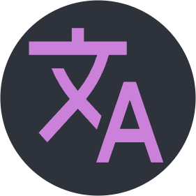

## i18n Haru | A better i18n extension for  <code>Vscode</code>

中文教程 | [English Tutorial](https://www.pandanese.com/blog/chinese-learning-websites)

---

## Usage Examples

### Hover Tips and Inlay Hints

### Autocomplete

### Go to Definition

### Diagnostics

### Quick Fixes

### Quick Creation of i18n Token

By selecting text in the editor, you can quickly create a new i18n token item (shortcut: alt i).

### Quick Deletion of i18n Token

In a JSON file, you can click the i18n delete button in the top right corner to delete a specific token across all i18n files simultaneously.

---

## Configuration

The core configuration requires setting up two functions (in `.vscode/setting.json`):

`i18n-haru-root`: The path to the i18n root directory (relative or absolute). i18n-haru will scan all JSON/YAML files in this folder and, after removing the suffix and the longest prefix, match the remaining string with each ISO639 code.

`i18n-haru-main`: The base language for the i18n system, defaulting to zh-cn. Most features, such as the autocomplete list, are generated based on the i18n items of the base language. Compared to the base language, parts missing in other i18n files will trigger an error warning, and redundant parts will be omitted.

---

## 使用示例

### 悬停提示 和 inlay hints

### 自动补全

### 定义跳转

### 诊断器

### 快速修复

### 快速创建 i18n token

通过选中编辑器中的文本，来快速创建一个新的 i18n token 项（快捷键 alt i）

### 快速删除 i18n token

如果在 json 文件中，可以通过点击右上角的 i18n 删除按钮同时在所有的 i18n 文件中删除某个 token：

---

## 配置

核心只需要配置两个函数（在 `.vscode/setting.json`）：

`i18n-haru-root` ：i18n 根目录的路径（相对或者绝对），i18n-haru 会扫描这个文件夹下所有的 json / yaml 文件，并在去除了后缀名和最长前缀后，用每一个 ISO639 编码去匹配剩余字符串。

`i18n-haru-main` ：i18n 系统的基准语言，默认是 zh-cn，大部分功能，比如自动补全生成的列表，里面的项目基于基准语言的 i18n 项目生成。 相比于基准语言，其他i18n文件没有的部分会发出 error 警告，多余的部分会直接省略。
